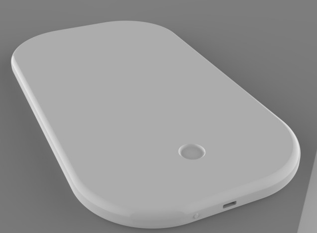

# Andre Fortou — Portfolio

Dark minimal portfolio site, ready to deploy to GitHub Pages.

## File structure

```
portfolio/
├── index.html                 ← homepage
├── stoma-cue.html             ← Stoma-Cue project page
├── mudi-ring.html             ← MUDI Ring project page
├── bioroot.html               ← Bioroot Coastal Defense
├── sustainable-vacuum.html    ← Sustainable Vacuum Redesign
├── images/                    ← ALL your images go here
│   ├── stomacue-hero.jpg
│   ├── stomacue-sketches.jpg
│   ├── stomacue-mockup.jpg
│   ├── stomacue-exploded.jpg
│   ├── stomacue-render1.jpg
│   ├── stomacue-belt.jpg
│   ├── mudi-hero.jpg
│   ├── mudi-render1.jpg
│   ├── mudi-render2.jpg
│   ├── mudi-wireframe.jpg
│   ├── bioroot-hero.jpg
│   ├── bioroot-sketches.jpg
│   ├── bioroot-abstraction.jpg
│   ├── bioroot-final.jpg
│   ├── vacuum-hero.jpg
│   ├── vacuum-sketch.jpg
│   ├── vacuum-exploded.jpg
│   ├── vacuum-ortho.jpg
│   └── headshot.jpg           ← your photo for the About section
└── Andre_Fortou_Resume.pdf    ← your resume
```

---

## Swapping placeholder images for real ones

Every image placeholder in the HTML looks like this:

```html
<!--  -->
<span class="img-full-placeholder">stomacue-hero.jpg — replace with your best render</span>
```

To activate an image:
1. Export your render/photo as a `.jpg`, name it exactly as shown (e.g. `stomacue-hero.jpg`)
2. Drop it into the `images/` folder
3. In the HTML, delete the `<span>` line and uncomment the `` line (remove `<!--` and `-->`)

**Image prep tips:**
- Hero images: 1600–2400px wide, 16:9 ratio, compressed to ~300KB
- Grid images: 800–1200px wide, 4:3 ratio  
- Headshot: portrait crop, 600×800px minimum

---

## Deploying to GitHub Pages (free, ~5 min)

1. Go to github.com, sign in or create an account
2. Click **New repository**. Name it exactly: `yourusername.github.io` (use your actual GitHub username)
3. Set it to **Public**, click **Create repository**
4. On the next screen, click **uploading an existing file**
5. Drag in your entire `portfolio/` folder contents (all HTML files, `images/` folder, PDF)
6. Click **Commit changes**
7. Go to **Settings → Pages → Source**: select `main` branch, `/ (root)`, click **Save**
8. Wait ~60 seconds. Your site is live at `https://yourusername.github.io`

---

## Updating your phone number / email

Search each HTML file for `afortou26@gmail.com` and `(305) 915-1579` — these are already set from your resume. Update if needed.

## Adding your headshot to the About section

In `index.html`, find:
```html
<div style="width:100%;height:100%;...">headshot.jpg</div>
```
Replace that `<div>` with:
```html

```

## Custom domain (optional)

If you buy a domain (e.g. `andrefortou.com` on Namecheap, ~$12/yr):
1. Add a file named `CNAME` in your repo root containing just: `andrefortou.com`
2. In your domain's DNS settings: add a CNAME record pointing to `yourusername.github.io`
3. In GitHub Pages settings: enter your domain, enable HTTPS
